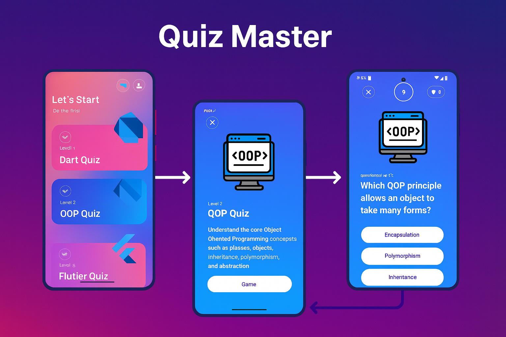

# 🎉 Quiz Master App

A simple and interactive quiz application built with **Flutter**.  
The app includes three main quiz levels:
- **Dart Quiz**
- **OOP Quiz**
- **Flutter Quiz**

Each level contains multiple-choice questions, a countdown timer, score tracking, and a results alert when finishing the quiz.

---

## 📱 Screens Preview

Below is a preview from the app (replace with your actual image):

---

## 🚀 Features

### 🏠 Home Screen
- Displays all quiz levels.
- Each level shows:
  - Title  
  - Subtitle  
  - Progress icon  
  - Gradient theme  
- Tapping a level opens its description page.

### 📄 Level Description Screen
- Shows:
  - Level image  
  - Title  
  - Short intro  
  - Level description  
- Starts the quiz with a single tap.

### 🧠 Quiz Screen
- Countdown timer (10 seconds for each question)
- Auto move to next question when time ends
- Buttons change color based on correctness:
  - 🟢 Correct
  - 🔴 Wrong
- Score tracking
- Success or Failure alert at the end
 
